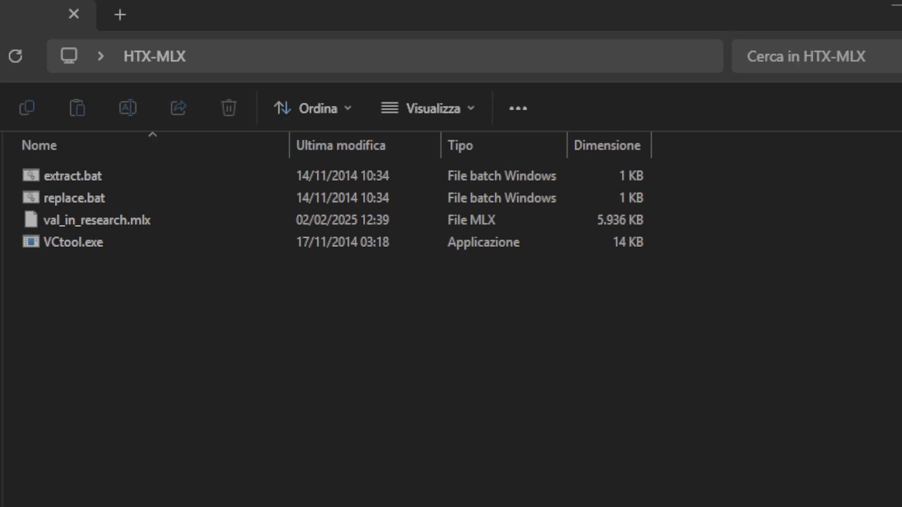
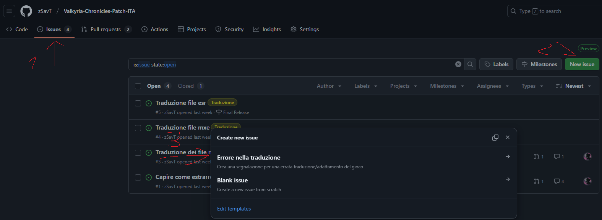
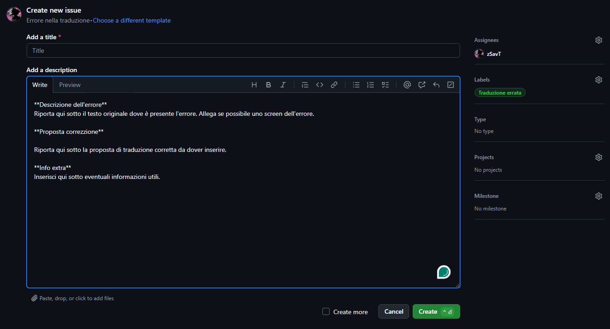

# Valkyria Chronicles Patch ITA 

   
    Progetto per la traduzione del gioco Valkyria Chronicles in italiano.

# INDICE

- [INDICE](#indice)
  - [STRUTTURA DEI FILE - DA TERMINARE](#struttura-dei-file---da-terminare)
    - [MPTA](#mpta)
    - [MX](#mx)
    - [HTX - MLX - DDS](#htx---mlx---dds)
  - [TO DO](#to-do)
  - [COME SEGNALARE ERRORI NELLA TRADUZIONE/BUG](#come-segnalare-errori-nella-traduzionebug)
  - [VIDEO DIMOSTRATIVO](#video-dimostrativo)
  - [SCREEN PROGETTO](#screen-progetto)
  - [CREDITI](#crediti)

## STRUTTURA DEI FILE - DA TERMINARE

### MPTA

Nella cartella "_Valkyria Chronicles\data\resource\mtpa_" sono presenti la maggior parte dei testi delle cinematiche, dei dialoghi in battaglia e del menu\libro. In particolare:

- __mtpa_adv_XX__, contiene i dialoghi presenti nelle cinematiche.
    - Limite massimo di caratteri: 120 (60 per riga)
    - Carattere a capo: &
- __mtpa_slg_XX__, contiene i dialoghi dei box presenti nelle battaglie.
    - Limite massimo di caratteri: 42/43
    - Carattere a capo: & (genera anche nuovi box di testo per inserire il testo mancante)
- ~~__mtpa_sys__, contiene testi vari per alcune opzioni del gioco e capitoli.~~ Il file non ha alcun impatto nel gioco, utilizzato solo per la versione PS3 del gioco.
    - ~~Limite massimo di caratteri: ?~~
    - ~~Carattere a capo: &~~
- __mtpa_sys_battle__, contiene testi vari per testi generici delle battaglie.
    - Limite massimo di caratteri: ?
    - Carattere a capo: &
- __mtpa_book__, contiene testi del menu libro dei capitoli.
    - Limite massimo di caratteri: ?
    - Carattere a capo: &
- __mtpa_town__, contiene testi vari, tra cui quelli dei box nel libro.
    - Limite massimo di caratteri: ?
    - Carattere a capo: &

### MX

Nella cartella "_Valkyria Chronicles\data\mx_" sono presenti tutti i file mxe che contengono tutto il testo restante (Impostazioni, nomi oggetti ecc...) 

### HTX - MLX - DDS

I file "_htx_" contengono le texture del gioco, dove sono presenti anche le gui del gioco e alcuni testi (come per esempio il messaggio di ending del gioco). Anche i file "_mlx_" contengono le texture per gli ambienti, personaggi ecc... All'interno dei file HTX e MLX sono presenti i file DSS delle texture. 
I file _DDS_ bisogna modificarli seguendo le linee guida indicate in questa [issue](https://github.com/zSavT/Valkyria-Chronicles-Patch-ITA/issues/1).

- Nella cartella "_Valkyria Chronicles\data\texture_replace_" sono presenti texture varie tra cui alcune contenente il testo di alcune interfacce di menu.
    - I file delle immagini sono direttamente nel formato "_dds_".
- Nella cartella "_Valkyria Chronicles\data\resource_" nelle varie sottocartella, sono presenti tutti i file HTX e MLX.
    - Per poter modificare questi due tipologie di file, bisogna utilizzare il [tool](https://steamcommunity.com/sharedfiles/filedetails/?id=343016567) di "__FluffyQuack__". 
    - Per estrarre le texture bisogna trascinare il file della texture sul .bat "_extract.bat_". In questo modo viene creata una cartella con lo stesso nome del file contenente tutte le texture presenti in formato .dds da dover modificare.
    - Per ri-compattare il file, bisogna inserire nella cartella (__Con il nome originale della cartella__), le texture modificate (__Con il nome del file originale della texture__). Bisogna trascinare il file originale sul .bat "_replace.bat_". In questo modo verrà modificato.
    - La cartella contenente le texture, i .bat (con annesso exe) ed il file di originale, devono stare nella stessa cartella madre per poter funzionare correttamente.
    - In alternativa si possono utillizzare i commandi tramite CLI indicati nella guida.

## TO DO

- [ ] Comprendere il funzionamento e logica dietro i file mtpa
- [ ] Comprendere il funzionamento e logica dietro i file mxe
- [x] Comprendere il funzionamento e logica dietro i file mlx
- [x] Comprendere il funzionamento e logica dietro i file htx
- [ ] Comprendere il funzionamento e logica dietro i file esr
- [ ] Tradurre e adattare tutti i testi mpta
- [ ] Tradurre e adattare tutti i testi mxe
- [ ] Tradurre e adattare tutti i testi esr
- [ ] Rifinire
- [ ] Test completo del gioco

## COME SEGNALARE ERRORI NELLA TRADUZIONE/BUG

Per segnalare errori nella traduzione, bisogna farlo, tramite la sezione "__issue__" della repo e selezionare il template "_Errori di traduzione_".

Successivamente bisogna riportare tutte le informazioni richieste per poter correggere l'errore. 
Stesso discorso per la segnalazione dei crash/bug del gioco.

## VIDEO DIMOSTRATIVO

## SCREEN PROGETTO

## CREDITI

Si ringrazia per tutto lo sfrozo di analisi dell'utente "__Feunoir__" postato [qui](https://www.jeuxvideo.com/forums/42-14107-38261510-1-0-1-0-traduction-du-jeu-aide-bienvenue.htm), per i csv di partenza per la traduzione e per i software di conversione da csv a mtpa e mxe. 
Si ringrazia l'utente Steam "__FluffyQuack__" per il tool di estrazione delle texture per i file htx e mlx [tool](https://steamcommunity.com/sharedfiles/filedetails/?id=343016567).
