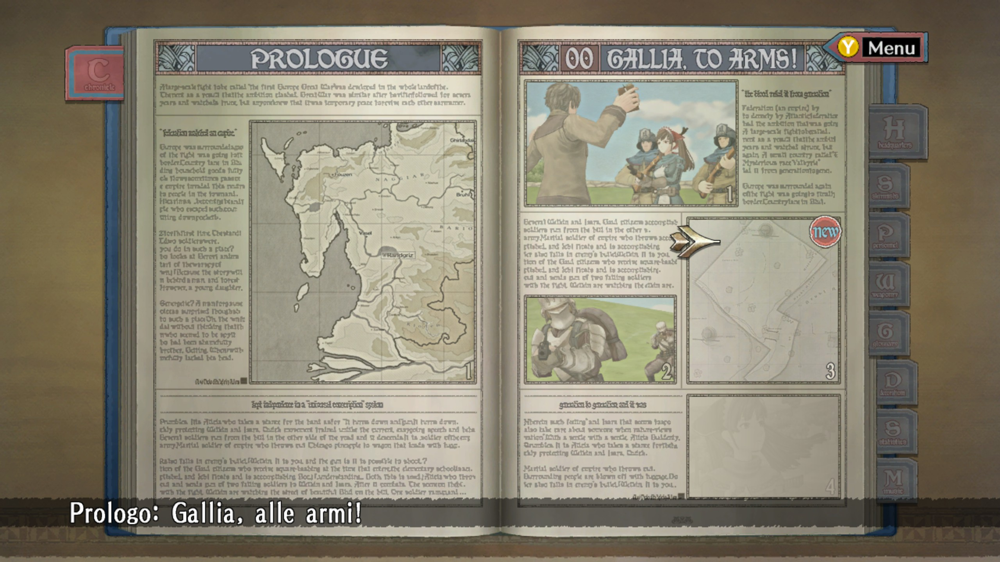

# Valkyria Chronicles Patch ITA 

   
    Progetto per la traduzione del gioco Valkyria Chronicles in italiano.

## STRUTTURA DEI FILE - DA TERMINARE

Nella cartella "_Valkyria Chronicles\data\resource\mtpa_" sono presenti la maggior parte dei testi delle cinematiche, dei dialoghi in battaglia e del menu\libro. In particolare:

- __mtpa_adv_XX__, contiene i dialoghi presenti nelle cinematiche.
    - Limite massimo di caratteri: 120 (60 per riga)
    - Carattere a capo: &
- __mtpa_slg_XX__, contiene i dialoghi dei box presenti nelle battaglie.
    - Limite massimo di caratteri: 42/43
    - Carattere a capo: & (genera anche nuovi box di testo per inserire il testo mancante)
- __mtpa_sys__, contiene testi vari per alcune opzioni del gioco e capitoli.
    - Limite massimo di caratteri: ?
    - Carattere a capo: &
- __mtpa_sys_battle__, contiene testi vari per testi generici delle battaglie.
    - Limite massimo di caratteri: ?
    - Carattere a capo: &
- __mtpa_book__, contiene testi del menu libro dei capitoli.
    - Limite massimo di caratteri: ?
    - Carattere a capo: &
- __mtpa_town__, contiene testi vari, tra cui quelli dei box nel libro.
    - Limite massimo di caratteri: ?
    - Carattere a capo: &

## TO DO

- [x] Comprendere il funzionamento e logica dietro i file mtpa
- [ ] Comprendere il funzionamento e logica dietro i file mxe
- [x] Comprendere il funzionamento e logica dietro i file htx [repo utile](https://github.com/Tes4Oblivion/htx---dds)
- [ ] Comprendere il funzionamento e logica dietro i file esr
- [ ] Tradurre e adattare tutti i testi mpta
- [ ] Tradurre e adattare tutti i testi mxe
- [ ] Tradurre e adattare tutti i testi esr
- [ ] Rifinire
- [ ] Test completo del gioco

## SCREEN PROGETTO

## CREDITI

Si ringrazia tutto lo studio che l'utente "__Feunoir__" per l'analisi postata [qui](https://www.jeuxvideo.com/forums/42-14107-38261510-1-0-1-0-traduction-du-jeu-aide-bienvenue.htm), per i csv di partenza per la traduzione e per i software di conversione da csv a mtpa e mxe.
